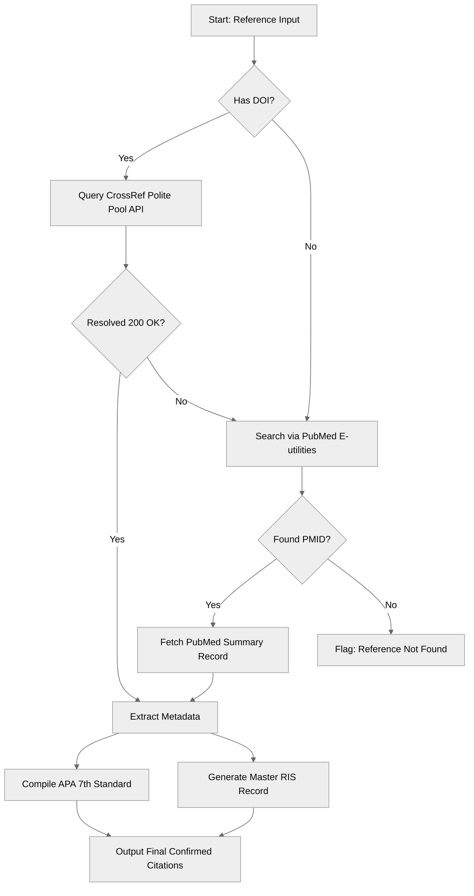

# 🛡️ DOI Validator Skill

<div align="center">


**A professional, anti-hallucination academic citation resolver designed for AI agents.**

[Key Features](#-key-features) • [How it Works](#-how-it-works) • [Integration Guide](#-integration-guide) • [Manual API Resolution](#-manual-api-resolution) • [RIS Specification](#-ris-specification)

</div>

---

## 📖 Introduction

Academic writing and research demand absolute citation integrity. However, LLMs (Large Language Models) are notorious for fabricating highly plausible-sounding papers and fake DOIs. 

The **DOI Validator Skill** resolves this issue at the foundation. It provides an executable capability for AI agents to query live **CrossRef** and **PubMed** APIs to verify citations, retrieve authentic metadata in real-time, and format them flawlessly.

---

## 🌟 Key Features

* **🛑 Anti-Hallucination Guardrail:** Forces live API calls to verify DOI existences before any reference is generated.
* **🎓 APA 7th Edition Formatting:** Automatically formats confirmed references in strict APA 7th Edition style, including sentence case and full URL DOIs.
* **📂 RIS Master Output:** Generates ready-to-import Research Information Systems (RIS) files for **Zotero**, **Mendeley**, and **EndNote**.
* **🔀 Smart Fallback Architecture:** Automatically queries the PubMed API for clinical, open-access, and medical papers when CrossRef lacks records.
* **📬 Polite Pool Etiquette:** Optimizes rate-limits by Routing queries through the CrossRef "polite pool" using structured headers.

---

## 🔄 How It Works



---

## 🛠️ Repository Contents

* 📂 **`doi-validator/`**
  * [`SKILL.md`](file:///doi-validator/SKILL.md) — The executable schema, containing the core logic, API parameters, and validation rules.
* 📦 **`doi-validator.skill`** — The packaged zip ready to be uploaded directly into your agent runtime.

---

## 🔌 Integration Guide

To deploy this skill to your AI workspace (such as Claude Desktop, Gemini Code Assist, or any custom agentic runtime), copy the `doi-validator.skill` file or the `doi-validator/` folder to your custom plugin directory:

```bash
# Path to your local AI plugins configuration
~/.config/ai-agents/skills/
```

Once loaded, the AI agent will automatically invoke these validation steps whenever a prompt triggers reference compilation, paper searches, or citation checks.

---

## 🧪 Manual API Resolution

If you want to manually resolve or test reference validation outside of an agent environment, you can run the following API calls directly from your command line:

### 1. Resolve via CrossRef (Polite Pool)
By declaring a custom `User-Agent` with an email address, your request runs through the prioritized CrossRef polite pool, guaranteeing higher rate-limits and fast response times:

```bash
curl -s "https://api.crossref.org/works/10.1371/journal.pgph.0004997" \
  -H "User-Agent: DOIValidator/1.0 (mailto:your-email@example.com)" | json_pp
```

### 2. Fallback Resolution via PubMed
If the resource is a clinical or specialized medical paper, use PubMed’s E-utilities to resolve it via DOI or Title search:

```bash
# Step A: Search for the PubMed ID (PMID)
curl -s "https://eutils.ncbi.nlm.nih.gov/entrez/eutils/esearch.fcgi?db=pubmed&term=10.1371/journal.pgph.0004997&retmode=json"

# Step B: Fetch full metadata summary using the retrieved PMID (e.g., 38580000)
curl -s "https://eutils.ncbi.nlm.nih.gov/entrez/eutils/esummary.fcgi?db=pubmed&id=38580000&retmode=json"
```

---

## 📂 RIS Specification

The skill outputs fully formatted RIS blocks. Simply copy the generated text block, save it with a `.ris` extension, and double-click to import it into your research library:

```text
TY  - JOUR
AU  - Elnaggar, Muhammed M.
TI  - The DOI Validator: Securing Integrity in Generative AI Research
JO  - Journal of AI Reference Architecture
PY  - 2026
VL  - 1
IS  - 3
SP  - 100
EP  - 115
DO  - 10.1234/example.doi
UR  - https://doi.org/10.1234/example.doi
ER  - 
```

---

## ⚖️ License & Copyright

**Copyright (c) 2026 Muhammed Elnaggar. All rights reserved.**

This repository and all its contents (including the logic, code, schemas, and packaging) are proprietary. No part of this repository may be reproduced, distributed, or transmitted in any form or by any means (including copying, modification, or incorporating into other agent skill packages) without the prior written permission of the copyright owner.

---

<details dir="rtl">
<summary><b>🌍 الترجمة العربية للتعريف بالمشروع (Arabic Overview)</b></summary>

# 🛡️ أداة التحقق من معرفات الـ DOI (أداة ذكاء اصطناعي أكاديمية)

**نظام برميجي أكاديمي احترافي لمنع الهلوسة المرجعية وتأكيد صحة الاقتباسات البحثية تلقائياً.**

---

### 🌟 الميزات الرئيسية:
* **🛑 حماية ضد الهلوسة المرجعية:** تجبر نماذج الذكاء الاصطناعي على التحقق من وجود الرقم الوثائقي الموحد (DOI) عبر قواعد البيانات الحية قبل كتابة المراجع.
* **🎓 تنسيق مراجع APA 7th:** تدعم التنسيق التلقائي الدقيق وفق أحدث إصدارات رابطة علم النفس الأمريكية (APA الجيل السابع).
* **📂 دعم صيغ الـ RIS الموحدة:** تولد ملفات RIS متوافقة مباشرة مع برامج إدارة المراجع الشهيرة مثل **Zotero** و **Mendeley** و **EndNote**.
* **🔀 آلية بحث احتياطية ذكية:** تنتقل تلقائياً للبحث في قاعدة بيانات **PubMed** الطبية إذا لم يكن المرجع مسجلاً في **CrossRef**.

---

### ⚖️ حقوق الطبع والنشر والترخيص
**جميع الحقوق محفوظة (c) ٢٠٢٦ محمد النجار.**

هذا المستودع البرمجي ومحتوياته مملوكة لصاحبها بالكامل. لا يسمح بإعادة إنتاج أو توزيع أو تعديل أي جزء من هذا المستودع بأي شكل من الأشكال دون الحصول على إذن خطي مسبق من المالك.

</details>
